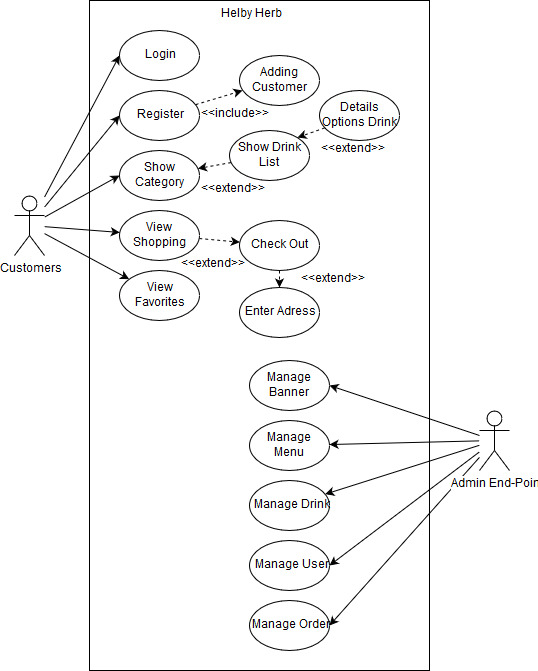
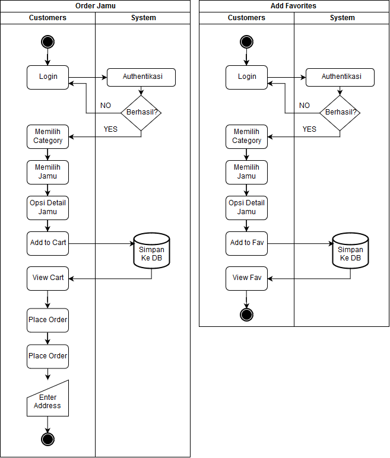
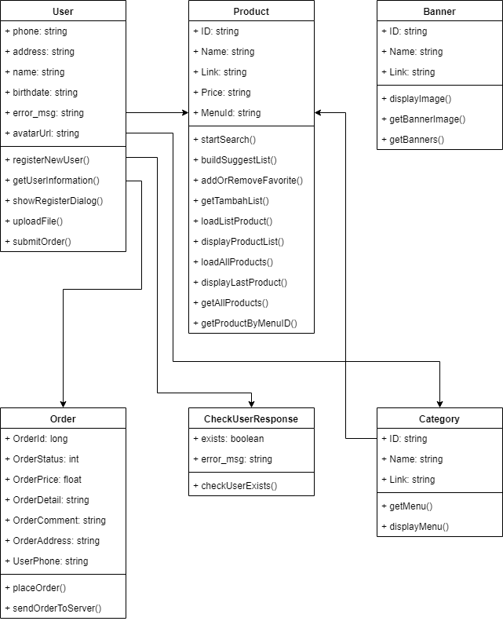
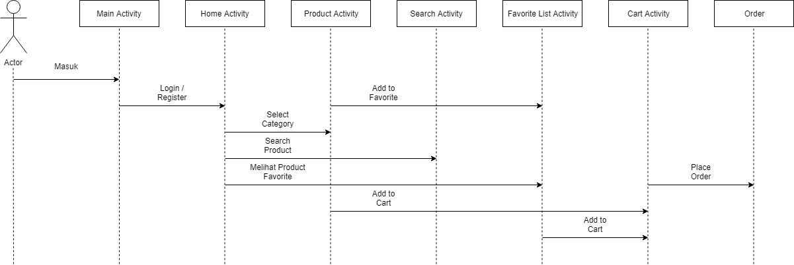

<h1 align="center"></h1>

[Tentang Aplikasi](#tentang-aplikasi) | [Use Case Diagram](#use-case-diagram) | [Activity Diagram](#activity-diagram) | [Class Diagram](#class-diagram) | [Sequence Diagram](#sequence-diagram)
:---:|:---:|:---:|:---:|:---:


# Tentang Aplikasi
[`^ kembali ke atas ^`](#)

**Helby-Herb** adalah aplikasi untuk meningkat marwah jamu ditingkat nasional maupun internasional berbasis *mobile* untuk membantu *customers* dalam pembelian jamu dengan sajian modern. **Helby-Herb** menyediakan jenis-jenis jamu se-nusantara. **Helby-Herb** juga menyediakan *list* *topping* pilihan berdasarkan selera *customers*.


# Teknologi yang Digunakan
## Android Studio
### Getting Started

**Download and Install Java**

You can download latest JDK from this url : http://www.oracle.com/technetwork/java/javase/downloads/index.html

**Download and Install Android**

You can download latest Android Studio from this url : https://developer.android.com/studio/

### Package Name
Library yang digunakan :

```groovy
implementation 'com.android.support:exifinterface:27.1.1'
implementation 'com.android.support:support-v4:27.1.1'
implementation 'com.android.support:cardview-v7:27.1.1'
implementation 'com.android.support:design:27.1.1'

implementation 'com.squareup.picasso:picasso:2.5.2'
implementation 'com.nineoldandroids:library:2.4.0'
implementation 'com.daimajia.slider:library:1.1.5@aar'

implementation 'io.reactivex.rxjava2:rxandroid:2.0.1'
implementation 'io.reactivex.rxjava2:rxjava:2.1.7'

implementation 'com.rengwuxian.materialedittext:library:2.1.4'
implementation 'com.szagurskii:patternedtextwatcher:0.5.0'
implementation 'com.github.d-max:spots-dialog:0.7@aar'

implementation 'com.squareup.retrofit2:retrofit:2.3.0'
implementation 'com.squareup.retrofit2:converter-gson:2.3.0'
implementation 'com.squareup.retrofit2:adapter-rxjava2:2.3.0'

implementation 'com.facebook.android:account-kit-sdk:4.+'

implementation 'com.cepheuen.elegant-number-button:lib:1.0.2'

implementation 'android.arch.persistence.room:runtime:1.1.0'
implementation 'android.arch.persistence.room:rxjava2:1.1.0'
annotationProcessor 'android.arch.persistence.room:compiler:1.1.0'

implementation 'com.nex3z:notification-badge:1.0.2'
implementation 'de.hdodenhof:circleimageview:2.2.0'

implementation 'com.github.mancj:MaterialSearchBar:0.8.1'
```
Retrofit, Room Database, Picasso, etc.

Modul yang digunakan :

aFileChooser - Android File Chooser. You can download latest from this url : https://github.com/iPaulPro/aFileChooser

```groovy
implementation project(":aFileChooser")
```
## XAMPP
* PHP 7.2.13 (cli) 
* Support MySQLi
* Apache

## PostMan
Digunakan untuk melakukan uji coba REST API yang telah dibuat.
## Trello
Digunakan untuk menyusun rencana kerja dan menyelesaikannya secara bersama-sama.

# Use Case Diagram
[`^ kembali ke atas ^`](#)

Use case diagram




# Activity Diagram
[`^ kembali ke atas ^`](#)

Acitivity diagram



# Class Diagram
[`^ kembali ke atas ^`](#)

Class diagram



# Sequence Diagram
[`^ kembali ke atas ^`](#)

Sequence diagram

